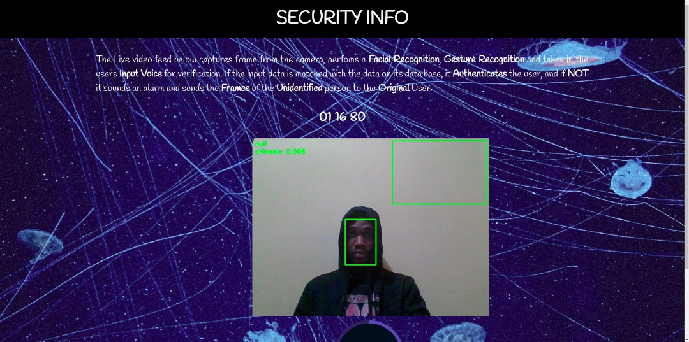
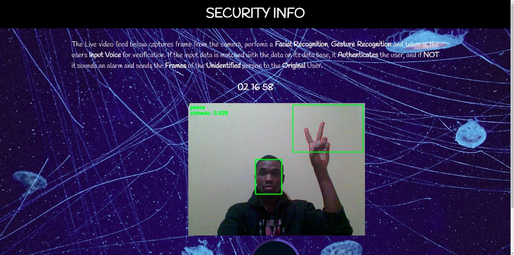
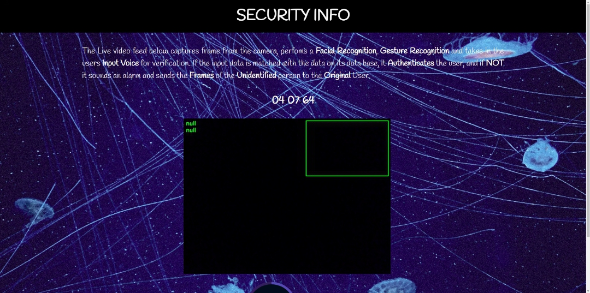

# FACIAL/ACOUSTIC SOUND WAVE AND GESTURE DETECTION (FASGD-III) 

     []

## Description 

  Facial/Acoustic Sound Wave And Gesture Detection <b>FASGD-III</b> is a security application that performs the following which are: 

<ul>

<li> Facial Recognition </li>
<li> Sound Recognition </li>
<li> Gesture Recognition </li>

</ul>

<h3> Facial Recognition </h3>

    

   

 A facial recognition device is a device that takes an image or a video of a human face and compares it to other images in a database. 
When building a facial recognition system, several pictures of the subject must have been taken at different angles and stored in a folder called the images dataset.
The dataset whose comprises of various images is trained on a deep learning or machine learning classifier to learn a mapping function on the relationships between the face. 
Once the machine learning classifier learns this mapping function, a serialized model weight file is generated and saved, which is then used to make live predictions on the individual faces.

<h3> Hand Gesture Recognition </h3> 

    

  

 Hand gesture recognition is a topic in computer science and language technology with the goal of interpreting human hand gestures via machine learning algorithms. This approach is made using cameras and computer vision algorithms to interpret sign language. 
With this camera, one can generate a depth map of what is being seen through the camera at short range, and use the data to approximate a 3D representation of what is being seen.   

In the hand gesture recognition, a single camera is used to explore the vision-based application of the security system. This security system would have had the user customize various functions of a number of different hand gestures. For example, the hang gestures functions could be the in following pattern: 
 <ul>
  <li> <b>Gesture A: </b>  Disable Alarm </li> 
  <li> <b> Gesture B:</b>  Unlock the security system </li>
  <li> <b> Gesture C: </b> Call the police or Dial 911 </li>  
 </ul>

Thus, this functions would be executed when a physical implementation is performed. 

The hand gesture recognition works when a motion sensor perceives and interprets movements as the basic source of data input. 
<ul>
  <li> Firstly, the camera feeds the image data into a sensing device that is connected to the system. </li> 
  <li> Secondly, the system identifies meaningful gestures from an established gesture library where each gesture is matched to a system command by the user. </li> 
  <li> Thirdly, the system connects each registered hand gesture, interprets the gesture and uses the library to identify meaningful gestures that match the library. Finally, once the gesture has been interpreted, the system executes the command or function correlated to the specific gesture. </li>

</ul> 

 

<h4> Null Readings </h4>

    

  

 This occurs when the frames are not reading and the camera is closed. 

<h3> Sound Recognition </h3>

  Sound recognition is ..... 

<h3> Working Principle </h3> 

 In the security system, the facial recognition model is the first application to perform its functions, because the cameras exposed are always accepting frames from the outside world. 

The cameras which are positioned at specific areas, scans the face seen in view to make predictions on if the identified persons matches the trained facec stored in its database.

Thus, if the subject face has been registered on the system like that of the owner and it runs a scan nothing really happens. However, if the subject's face has not been registered on the security system and it runs a scan, this causes the system to either sound an alarm or send notification to the owner's mobile application. 

 

## Prerequisites 

 The following packages and modules are needed for the application to work on your system:
  <ul>
      <li> Python 3.6.6 </li>
      <li> <b> Anaconda</b> Package Manager </li> 
      <li> Face-recognition module </li> 
      <li> Flask </li> 
      <li> Flask-SQLAlchemy </li> 
      <li> Imutils </li> 
      <li> Keras </li> 
      <li> Librosa (Sound Wave Library) </li> 
      <li> Scikit-learn </li> 
      <li> Scipy </li> 
      <li> Sklearn </li> 
      <li> SoundFile </li> 
      <li> Tensorflow </li> 
      <li> Werkzeug </li> 
      <li> Joblib </li> 
      <li> FFmpeg </li> 

  </ul>

## Installation 

#### Using Anaconda 

 Activating anaconda environments 

| Command | Description  | 
|------------- | ------------- | 
| <b>$</b> conda activate ml | This would switch your anaconda environment into <b>ml</b> environment |

#### Using Virtual Environment 

 Using the virtual environment .......  

## Running The Application 

## Deployment 

## Contributing 

## Authors 

## Acknowledgments 

